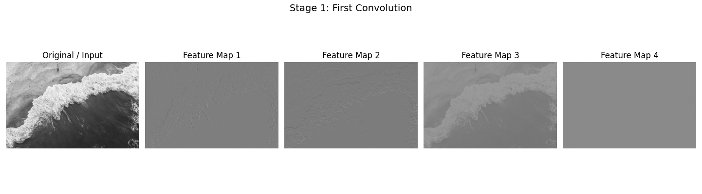
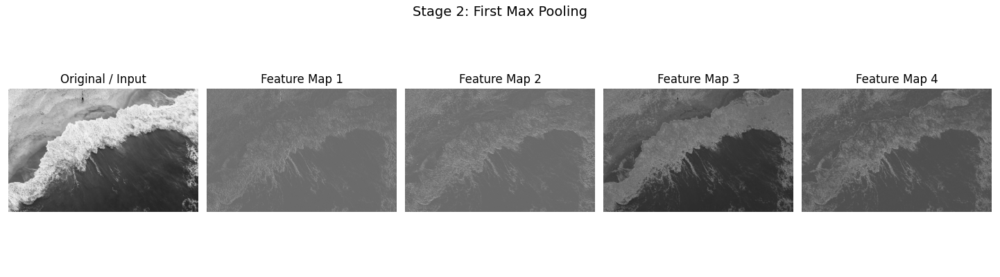
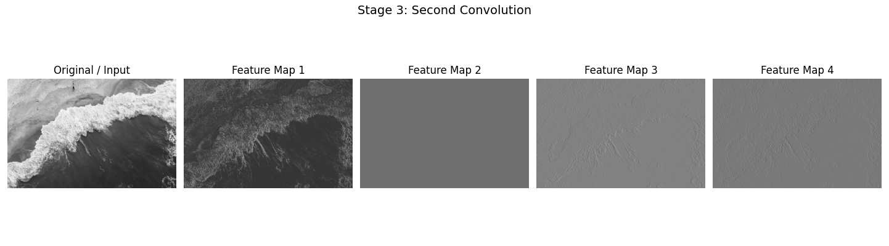
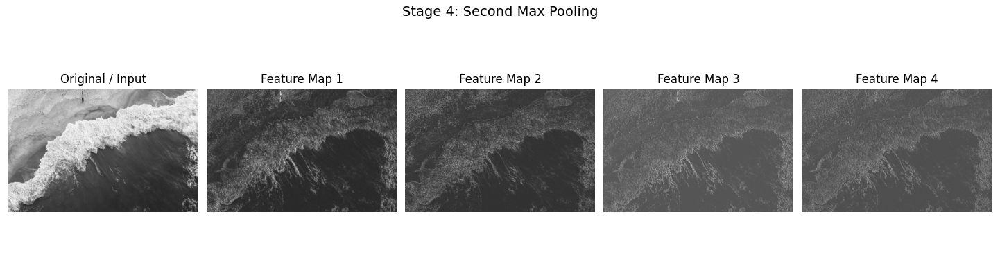
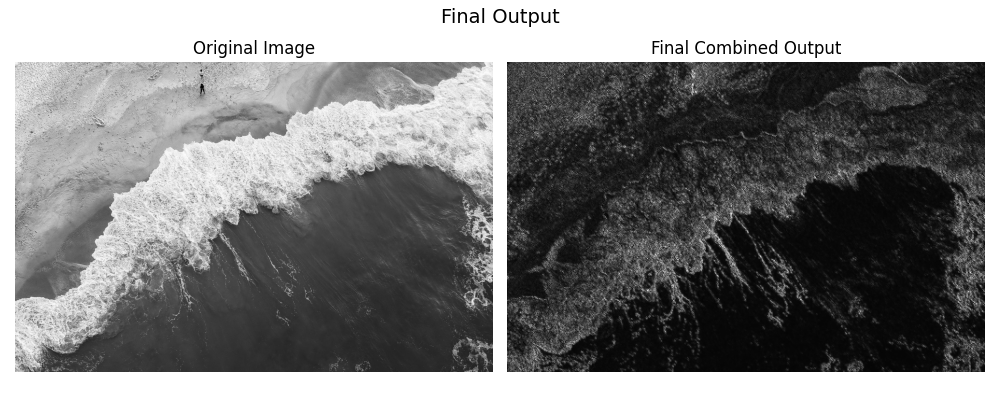

# CNN Visualizer Project

This project demonstrates a step-by-step visualization of how a simple convolutional neural network processes an image. Starting from the original input, the image is passed through a first convolution stage where different filters extract low-level features such as edges and textures, followed by max pooling which reduces the spatial size while preserving the strongest responses. A second convolution is then applied to these feature maps, combining earlier patterns into more abstract representations, and another max pooling step further compresses the information by keeping only dominant structures. Finally, the resulting feature maps are combined into a single output that represents a simplified and abstract version of the original image, illustrating how CNNs progressively transform raw pixel data into compact, meaningful features.

---

## 🧠 Pipeline Overview

The project processes a single image through the following steps:

1. Original image
2. First convolution (4 feature maps)
3. First max pooling (4 feature maps)
4. Second convolution (4 feature maps)
5. Second max pooling (4 feature maps)
6. Final combined output

---

## 🔍 Stage 1 — First Convolution

Applies multiple filters to extract low-level features such as edges and textures.



---

## 🔍 Stage 2 — First Max Pooling

Reduces spatial size while keeping the strongest responses.



---

## 🔍 Stage 3 — Second Convolution

Builds more abstract representations from previously extracted features.



---

## 🔍 Stage 4 — Second Max Pooling

Further compresses the feature maps and removes less important details.



---

## 🏁 Final Output

Combines all feature maps into a compact representation of the image.



---

## ⚠️ Important Note

This is a visualization project, not a trained neural network.
It uses fixed kernels to clearly demonstrate how convolution and pooling work.

---

## 📁 Files

* `cnn_visualizer.py` — main script
* `requirements.txt` — dependencies

---

## ⚙️ Installation

```bash
pip install -r requirements.txt
```

---

## ▶️ Run

### Option 1: choose image with file picker

```bash
python cnn_visualizer.py
```

### Option 2: pass an image directly

```bash
python cnn_visualizer.py --image path/to/your/image.jpg
```

---

## 💡 What This Project Demonstrates

* Understanding of convolution and feature extraction
* Visualization of CNN internal transformations
* Effect of pooling on spatial information
* Transition from raw pixels to abstract representations

---

## 🚀 Summary

This project provides an intuitive, visual understanding of how convolutional neural networks progressively transform images into meaningful feature representations, making it a useful educational tool for learning computer vision fundamentals.
